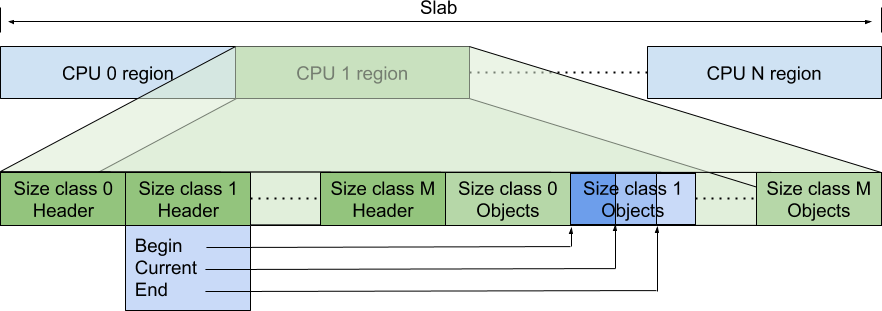

# Restartable Sequence Mechanism for TCMalloc

<!--*
# Document freshness: For more information, see go/fresh-source.
freshness: { owner: 'ckennelly' reviewed: '2026-02-24' }
*-->

## per-CPU Caches

TCMalloc implements its per-CPU caches using restartable sequences (`man
rseq(2)`) on Linux. This kernel feature was developed by
[Paul Turner and Andrew Hunter at Google](http://www.linuxplumbersconf.net/2013/ocw//system/presentations/1695/original/LPC%20-%20PerCpu%20Atomics.pdf)
and Mathieu Desnoyers at EfficiOS. Restartable sequences let us execute a region
to completion (atomically with respect to other threads on the same CPU) or to
be aborted if interrupted by the kernel by preemption, interrupts, or signal
handling.

Choosing to restart on migration across cores or preemption allows us to
optimize the common case - we stay on the same core - by avoiding atomics, over
the more rare case - we are actually preempted. As a consequence of this
tradeoff, we need to make our code paths actually support being restarted. The
entire sequence, except for its final store to memory which *commits* the
change, must be capable of starting over.

This carries a few implementation challenges:

*   We need fine-grained control over the generated assembly, to ensure stores
    are not reordered in unsuitable ways.
*   The restart sequence is triggered if the kernel detects a context switch
    occurred with the PC in the restartable sequence code. If this happens
    instead of restarting at this PC, it restarts the thread at an abort
    sequence, the abort sequence determines the interrupted restartable
    sequence, and then returns to control to the entry point of this sequence.

    We must preserve adequate state to successfully restart the code sequence.
    In particular, we must preserve the function parameters so that we can
    restart the sequence with the same conditions; next we must reload any
    parameters like the CPU ID, and recompute any necessary values.

## Structure of the `TcmallocSlab`

In per-CPU mode, we allocate an array of `N` `TcmallocSlab::Slabs`. For all
operations, we index into the array with the logical CPU ID.

Each slab has a header region of control data (one 8-byte header per-size
class). These index into the remainder of the slab, which contains pointers to
free listed objects.



In
[C++ code](https://github.com/google/tcmalloc/blob/master/tcmalloc/internal/percpu_tcmalloc.h),
these are represented as:

```
struct Slabs {
  std::atomic<int32_t> header[NumClasses];
  void* mem[((1ul << Shift) - sizeof(header)) / sizeof(void*)];
};

  // Slab header (packed, atomically updated 32-bit).
  // Current and end are pointer offsets from per-CPU region start.
  // The slot array is in [begin, end), and the occupied slots are in
  // [begin, current). Begin is stored separately, it's constant and
  // the same for all CPUs.
  struct Header {
    // The end offset of the currently occupied slots.
    uint16_t current;
    // The end offset of the slot array for this size class.
    uint16_t end;
  };
```

The atomic `header` allows us to read the state (esp. for telemetry purposes) of
a core without undefined behavior.

The fields in `Header` are indexed in `sizeof(void*)` strides into the slab. For
the default value of `Shift=18`, this allows us to cache nearly 32K objects per
CPU. Ongoing work encodes `Slabs*` and `Shift` into a single pointer, allowing
it to be dynamically updated at runtime.

We have allocated capacity for `end-begin` objects for a given size-class.
`begin` is chosen via static partitioning at initialization time. `end` is
chosen dynamically at a higher-level (in `tcmalloc::CPUCache`), as to:

*   Avoid running into the next size-classes' `begin`
*   Balance cached object capacity across size-classes, according to the
    specified byte limit.

## Usage: Allocation

As the first operation, we can look at allocation, which needs to read the
pointer at index `current-1`, return that object, and decrement `current`.
Decrementing `current` is the *commit* operation.

In pseudo-C++, this looks like:

```
void* TcmallocSlab_Pop(
    void *slabs,
    size_t size_class,
    UnderflowHandler underflow_handler) {
  // Expanded START_RSEQ macro...
restart:
  __rseq_abi.rseq_cs = &__rseq_cs_TcmallocSlab_Pop;
start:
  // Actual sequence
  Slab* slab = tcmalloc_slabs;
  if (slab->marker != vcpu + TCMALLOC_SLAB_CPU_BIAS) { return CacheSlab(); }
  Header* hdr = &slab.header[size_class];
  uint64_t current = hdr->current;
  void* ret = *(&slab + current * sizeof(void*) - sizeof(void*));
  // The element before the array is specifically marked with the low bit set.
  if (ABSL_PREDICT_FALSE((uintptr_t)ret & 1)) {
    goto underflow;
  }
  void* next = *(&slab + current * sizeof(void*) - 2 * sizeof(void*))
  --current;
  hdr->current = current;
commit:
  prefetcht0(next);
  return ret;
underflow:
  return nullptr;
}

// This is implemented in assembly, but for exposition.
ABSL_CONST_INIT kernel_rseq_cs __rseq_cs_TcmallocSlab_Pop = {
  .version = 0,
  .flags = 0,
  .start_ip = &&start,
  .post_commit_offset = &&commit - &&start,
  .abort_ip = &&abort,
};
```

`__rseq_cs_TcmallocSlab_Pop` is a read-only data structure, which contains
metadata about this particular restartable sequence. When the kernel preempts
the current thread, it examines this data structure. If the current instruction
pointer is between `[start, commit)`, it returns control to a specified,
per-sequence restart header at `abort`.

Since the *next* object is frequently allocated soon after the current object,
the allocation path prefetches the pointed-to object. To avoid prefetching a
wild address, we populate `slabs[cpu][begin]` for each CPU/size-class with a
pointer-to-self.

This sequence terminates with the *single* committing store to `hdr->current`.
If we are migrated or otherwise interrupted, we restart the preparatory steps,
as the values of `cpu_id` and `current` may have changed.

As these operations work on a single core's data and are executed on that core.
From a memory ordering perspective, loads and stores need to appear on that core
in program order.

### Restart Handling

The `abort` label is distinct from `restart`. The `rseq` API provided by the
kernel (see below) requires a "signature" (typically an intentionally invalid
opcode) in the 4 bytes prior to the restart handler. We form a small
trampoline - properly signed - to jump back to `restart`.

In x86 assembly, this looks like:

```
  // Encode nop with RSEQ_SIGNATURE in its padding.
  .byte 0x0f, 0x1f, 0x05
  .long RSEQ_SIGNATURE
  .local TcmallocSlab_Push_trampoline
  .type TcmallocSlab_Push_trampoline,@function
  TcmallocSlab_Push_trampoline:
abort:
  jmp restart
```

This ensures that the 4 bytes prior to `abort` match up with the signature that
was configured with the `rseq` syscall.

On x86, we can represent this with a nop which would allow for interleaving in
the main implementation. On other platforms - with fixed width instructions -
the signature is often chosen to be an illegal/trap instruction, so it has to be
disjoint from the function's body.

## Usage: Deallocation

Deallocation uses two stores, one to store the deallocated object and another to
update `current`. This is still compatible with the restartable sequence
technique, as there is a *single* commit step, updating `current`. Any preempted
sequences will overwrite the value of the deallocated object until a successful
sequence commits it by updating `current`.

```
int TcmallocSlab_Push(
    void *slab,
    size_t size_class,
    void* item,
    OverflowHandler overflow_handler) {
  // Expanded START_RSEQ macro...
restart:
  __rseq_abi.rseq_cs = &__rseq_cs_TcmallocSlab_Push;
start:
  // Actual sequence
  Slab* slab = tcmalloc_slabs;
  if (slab->marker != vcpu + TCMALLOC_SLAB_CPU_BIAS) { return CacheSlab(); }
  Header* hdr = &slab.header[size_class];
  uint64_t current = hdr->current;
  uint64_t end = hdr->end;
  if (ABSL_PREDICT_FALSE(current >= end)) {
    goto overflow;
  }

  *(&slab + current * sizeof(void*) - sizeof(void*)) = item;
  current++;
  hdr->current = current;
commit:
  return;
overflow:
  return overflow_handler(cpu_id, size_class, item);
}
```

## Initialization of the Slab

To reduce metadata demands, we lazily initialize the slabs for each CPU. When we
first cache slab pointer for the given CPU (see slab pointer caching section
below), we initialize `Header` for each size class.

## More Complex Operations: Batches

When the cache under or overflows, we populate or remove a full batch of objects
obtained from inner caches. This amortizes some of the lock acquisition/logic
for those caches. Using a similar approach to push and pop, we read/write a
batch of `N` items and we update `current` to commit the operation.

## Kernel API and implementation

This section contains notes on the rseq API provided by the kernel, which is not
well documented, and code pointers for how it is implemented.

The `rseq` syscall is implemented by
[`sys_rseq`](https://github.com/torvalds/linux/blob/414eece95b98b209cef0f49cfcac108fd00b8ced/kernel/rseq.c#L304-L366).
It starts by
[handling](https://github.com/torvalds/linux/blob/414eece95b98b209cef0f49cfcac108fd00b8ced/kernel/rseq.c#L312-L328)
the case where the thread wants to unregister, implementing that by clearing the
[rseq information](https://github.com/torvalds/linux/blob/414eece95b98b209cef0f49cfcac108fd00b8ced/include/linux/sched.h#L1188-L1189)
out of the `task_struct` for the thread running
[on the current CPU](https://github.com/torvalds/linux/blob/414eece95b98b209cef0f49cfcac108fd00b8ced/arch/x86/include/asm/current.h#L11-L18).
It then moves on to
[return an error](https://github.com/torvalds/linux/blob/414eece95b98b209cef0f49cfcac108fd00b8ced/kernel/rseq.c#L333-L345)
if the thread is already registered for rseq. Then it
[validates](https://github.com/torvalds/linux/blob/414eece95b98b209cef0f49cfcac108fd00b8ced/kernel/rseq.c#L347-L355)
and
[saves](https://github.com/torvalds/linux/blob/414eece95b98b209cef0f49cfcac108fd00b8ced/kernel/rseq.c#L356-L357)
the input from the user, and
[sets](https://github.com/torvalds/linux/blob/414eece95b98b209cef0f49cfcac108fd00b8ced/kernel/rseq.c#L358-L363)
the
[`TIF_NOTIFY_RESUME` flag](https://github.com/torvalds/linux/blob/414eece95b98b209cef0f49cfcac108fd00b8ced/include/linux/sched.h#L2044-L2048)
for the thread.

### Restarts

Among other things, the user's input to the `rseq` syscall is used by
`rseq_ip_fixup` to
[decide](https://github.com/torvalds/linux/blob/414eece95b98b209cef0f49cfcac108fd00b8ced/kernel/rseq.c#L232-L238)
whether we're in a critical section and if so
[restart](https://github.com/torvalds/linux/blob/414eece95b98b209cef0f49cfcac108fd00b8ced/kernel/rseq.c#L247)
at the abort point. That function is
[called](https://github.com/torvalds/linux/blob/414eece95b98b209cef0f49cfcac108fd00b8ced/kernel/rseq.c#L271)
by `__rseq_handle_notify_resume`, which is
[documented](https://github.com/torvalds/linux/blob/414eece95b98b209cef0f49cfcac108fd00b8ced/kernel/rseq.c#L251-L261)
as needing to be called after preemption or signal delivery before returning to
the user. That in turn is called by
[`rseq_handle_notify_resume`](https://github.com/torvalds/linux/blob/414eece95b98b209cef0f49cfcac108fd00b8ced/include/linux/sched.h#L2052-L2057),
a simple wrapper that bails if rseq is not enabled for the thread.

Here is one path that causes us to wind up here on x86:

*   [`rseq_signal_deliver`](https://github.com/torvalds/linux/blob/414eece95b98b209cef0f49cfcac108fd00b8ced/include/linux/sched.h#L2065)
*   [`setup_rt_frame`](https://github.com/torvalds/linux/blob/414eece95b98b209cef0f49cfcac108fd00b8ced/arch/x86/kernel/signal.c#L690-L691)
*   [`handle_signal`](https://github.com/torvalds/linux/blob/414eece95b98b209cef0f49cfcac108fd00b8ced/arch/x86/kernel/signal.c#L746)
*   [`arch_do_signal_or_restart`](https://github.com/torvalds/linux/blob/414eece95b98b209cef0f49cfcac108fd00b8ced/arch/x86/kernel/signal.c#L812-L813)
*   [`handle_signal_work`](https://github.com/torvalds/linux/blob/414eece95b98b209cef0f49cfcac108fd00b8ced/kernel/entry/common.c#L147)
*   [`exit_to_user_mode_loop`](https://github.com/torvalds/linux/blob/414eece95b98b209cef0f49cfcac108fd00b8ced/kernel/entry/common.c#L171)
*   [`exit_to_user_mode_prepare`](https://github.com/torvalds/linux/blob/414eece95b98b209cef0f49cfcac108fd00b8ced/kernel/entry/common.c#L208)

So the choke point is the code that returns to user space. Here are some notes
on how the restart logic varies based on user input:

*   `rseq_ip_fixup`
    [calls](https://github.com/torvalds/linux/blob/414eece95b98b209cef0f49cfcac108fd00b8ced/kernel/rseq.c#L228)
    `rseq_get_rseq_cs` every time. That means it
    [reads](https://github.com/torvalds/linux/blob/414eece95b98b209cef0f49cfcac108fd00b8ced/kernel/rseq.c#L123-L124)
    the
    [pointer](https://github.com/torvalds/linux/blob/414eece95b98b209cef0f49cfcac108fd00b8ced/include/uapi/linux/rseq.h#L91-L124)
    to `struct rseq_cs` and then
    [indirects](https://github.com/torvalds/linux/blob/414eece95b98b209cef0f49cfcac108fd00b8ced/kernel/rseq.c#L131-L133)
    through it fresh from user memory each time. It
    [checks](https://github.com/torvalds/linux/blob/414eece95b98b209cef0f49cfcac108fd00b8ced/kernel/rseq.c#L135-L145)
    for invalid cases (which
    [cause](https://github.com/torvalds/linux/blob/414eece95b98b209cef0f49cfcac108fd00b8ced/kernel/rseq.c#L278-L280)
    a segfault for the user process) and then does
    [validation](https://github.com/torvalds/linux/blob/414eece95b98b209cef0f49cfcac108fd00b8ced/kernel/rseq.c#L147-L157)
    of the abort IP signature discussed below.

*   Signature validation: from
    [the code](https://github.com/torvalds/linux/blob/414eece95b98b209cef0f49cfcac108fd00b8ced/kernel/rseq.c#L147-L157)
    linked above we can see that the requirement is that the abort handler
    specified by `rseq_cs::abort_ip` be preceded by a 32-bit magic integer that
    [matches](https://github.com/torvalds/linux/blob/414eece95b98b209cef0f49cfcac108fd00b8ced/kernel/rseq.c#L152)
    the one originally provided to and
    [saved by](https://github.com/torvalds/linux/blob/414eece95b98b209cef0f49cfcac108fd00b8ced/kernel/rseq.c#L357)
    the `rseq` syscall.

    The intent is to avoid turning buffer overflows into arbitrary code
    execution: if an attacker can write into memory then they can control
    `rseq_cs::abort_ip`, which is kind of like writing a jump instruction into
    memory, which can be seen as breaking
    [W^X](https://en.wikipedia.org/wiki/W%5EX) protections. Instead the kernel
    has the caller pre-register a magic value from the executable memory that
    they want to run, under the assumption that an attacker is unlikely to be
    able to find other usable "gadgets" in executable memory that happen to be
    preceded by that value.

It's also worth noting that signals and preemption always
[result in](https://github.com/torvalds/linux/blob/414eece95b98b209cef0f49cfcac108fd00b8ced/kernel/rseq.c#L238-L242)
[clearing](https://github.com/torvalds/linux/blob/414eece95b98b209cef0f49cfcac108fd00b8ced/kernel/rseq.c#L197-L210)
`rseq::rseq_cs::ptr64` from user space memory on the way out, except in error
cases that cause a segfault.

### CPU IDs

The other thing `rseq.c` takes care of is writing CPU IDs to user space memory.

There are two fields in user space that get this information:
[`rseq::cpu_id_start`](https://github.com/torvalds/linux/blob/414eece95b98b209cef0f49cfcac108fd00b8ced/include/uapi/linux/rseq.h#L63-L75)
and
[`rseq::cpu_id`](https://github.com/torvalds/linux/blob/414eece95b98b209cef0f49cfcac108fd00b8ced/include/uapi/linux/rseq.h#L76-L90).
The difference between the two is that `cpu_id_start` is always in range,
whereas `cpu_id` may contain error values. The kernel provides both in order to
support computation of values derived from the CPU ID that happens before
entering the critical section. We could do this with one CPU ID, but it would
require an extra branch to distinguish "not initialized" from "CPU ID changed
after fetching it". On the other hand if (like tcmalloc) you only fetch the CPU
Id within a critical section, then you need only one field because you have only
one branch: am I initialized. There is no such thing as a CPU mismatch because
instead you are just restarted when the CPU ID changes.

The two CPU ID fields are maintained as follows:

*   [`rseq_update_cpu_id`](https://github.com/torvalds/linux/blob/414eece95b98b209cef0f49cfcac108fd00b8ced/kernel/rseq.c#L84-L94)
    writes a CPU ID into each. This is
    [called](https://github.com/torvalds/linux/blob/414eece95b98b209cef0f49cfcac108fd00b8ced/kernel/rseq.c#L274-L275)
    by `__rseq_handle_notify_resume`, which is discussed above.

*   [`rseq_reset_rseq_cpu_id`](https://github.com/torvalds/linux/blob/414eece95b98b209cef0f49cfcac108fd00b8ced/kernel/rseq.c#L96-L113)
    sets the `cpu_id_start` field to zero and the `cpu_id` field to
    [`RSEQ_CPU_ID_UNINITIALIZED`](https://github.com/torvalds/linux/blob/414eece95b98b209cef0f49cfcac108fd00b8ced/include/uapi/linux/rseq.h#L17)
    (an out of range value). It is
    [called](https://github.com/torvalds/linux/blob/414eece95b98b209cef0f49cfcac108fd00b8ced/kernel/rseq.c#L322)
    in the unregister path discussed above.

## Current CPU Slabs Pointer Caching

Calculation of the pointer to the current CPU slabs pointer is relatively
expensive due to support for virtual CPU IDs and variable shifts. To remove this
calculation from fast paths, we cache the slabs address for the current CPU in
thread local storage.

The cached address is validated against the region it points at, rather than
against any per-thread state. The size class 0 header of every per-CPU region is
otherwise unused, so it holds a 32-bit *marker*:

*   `0` for a region that has never been populated. Both `mmap` and
    `MADV_DONTNEED` leave the region zeroed, so this state costs nothing to
    produce.
*   `TCMALLOC_SLAB_STOPPED` (`0xffffffff`) for a region that a cross-CPU
    operation currently owns.
*   `cpu + TCMALLOC_SLAB_CPU_BIAS` for the current, usable region of `cpu`. The
    bias keeps CPU 0's marker distinguishable from an unpopulated region. The
    fast paths load the CPU ID as a 16-bit value, so `cpu +
    TCMALLOC_SLAB_CPU_BIAS` fits in 17 bits and can never alias
    `TCMALLOC_SLAB_STOPPED`.

Slabs address validation on allocation/deallocation fast paths reduces to a load
of the cached address, a load of its marker, and a comparison against the
current virtual CPU ID (read from `__rseq_abi` at
`__rseq_virtual_flat_cpu_id_offset`):

```
  slabs = tcmalloc_slabs;
  if (*(uint32_t*)slabs != vcpu + TCMALLOC_SLAB_CPU_BIAS) goto slowpath;
```

A thread that has no region cached names `tcmalloc_dummy_slab`, a read-only
region whose marker is `0`, rather than nothing at all. The comparison above
therefore subsumes the "is a region cached?" question, and the fast paths need
no separate test for a null address.

Both loads happen inside the restartable sequence, so a migration between them
and the commit store restarts the sequence. A mismatch means the thread was
rescheduled onto another CPU, a cross-CPU operation owns this CPU's region, or
`ResizeSlabs` replaced the region. The slow path tells them apart: it does the
full address calculation and caches the result, except when a cross-CPU
operation owns the region, where it caches nothing and reports that the caller
should use the backing cache instead.

Because validity is a property of the region and not of the thread, a cached
address never has to be invalidated remotely: it simply stops matching. Old slab
buffers must therefore remain mapped and readable for the lifetime of the
process. They may be `MADV_DONTNEED`ed, which resets their markers to `0`, but
they must never be `munmap`ed or `MADV_REMOVE`d.

### Kernel Guarantees This Relies On

Reading the CPU ID inside a restartable sequence is only an identity check if
the kernel cannot change that ID and then let the thread continue executing
inside the sequence. It cannot: the kernel writes the ID fields of `struct rseq`
and performs the sequence's IP fixup in the same return-to-userspace transition,
with interrupts disabled and the IDs written first (`rseq_set_ids_get_csaddr`
followed by `rseq_update_user_cs`, upstream `include/linux/rseq_entry.h`). A
sequence that could observe a stale ID has already been redirected to its abort
handler. Under virtual CPUs the production kernel releases the virtual CPU ID
from `prepare_task_switch` immediately before `rseq_preempt`, binding the
release to the abort in the same way.

The previous scheme relied on a second, stronger property: that the kernel
writes `cpu_id_start` on *every* rseq event, even when the ID has not changed.
Upstream has since made that write conditional for registrations longer than the
original 32-byte `struct rseq`, and in that mode it terminates a process that
writes the ID fields itself. Validating the region rather than overlapping the
cached pointer with `cpu_id_start` removes both dependencies.

## Cross-CPU Operations

With restartable sequences, we've optimized the fast path for same-CPU
operations at the expense of costlier cross-CPU operations. Cross-CPU operations
are rare, so this is a desirable tradeoff. Cross-CPU operations include capacity
growing/shrinking, and periodic drains and resizes of idle caches.

Cross-CPU operations rely on operating system assistance (wrapped in
`tcmalloc::tcmalloc_internal::subtle::percpu::FenceCpu`) to interrupt any
running restartable sequences on the remote core. When control is returned to
the thread running on that core, we have guaranteed that either the restartable
sequence that was running has completed *or* that the restartable sequence was
preempted.

Synchronization protocol between start of a cross-CPU operation and local
allocation/deallocation: the cross-CPU operation stores `TCMALLOC_SLAB_STOPPED`
into the region's marker and calls `FenceCpu`. Every local operation re-checks
the marker within its restartable sequence, so after `FenceCpu` completes, all
local operations have finished or aborted, and no new ones can start. This part
of the synchronization protocol uses relaxed atomic operations on the marker and
only compiler ordering. This is sufficient because `FenceCpu` provides all
necessary synchronization between threads.

Synchronization protocol between end of a cross-CPU operation and local
allocation/deallocation: the cross-CPU operation restores the running marker
using release memory ordering. On x86, the fast path's load of the marker is
implicitly acquire, so a thread that observes the running marker also observes
all side-effects of the cross-CPU operation. AArch64 fast paths load the marker
with a relaxed `ldr`, so `StartCpu`/`StartAllCpus` issue a
`FenceCpu`/`FenceAllCpus` before publishing the running marker instead.

Combined these 2 parts of the synchronization protocol ensure that cross-CPU
operations work on completely quiescent state, with no other threads
reading/writing slabs. The only exception is `Length`/`Capacity` methods that
can still read slabs.

`ResizeSlabs` and `UpdateMaxCapacities` initialize the new region for every
populated CPU before they stop those CPUs, and they publish the new slabs before
they start them. A newly initialized region is therefore left with
`TCMALLOC_SLAB_STOPPED` rather than `0`: for the window between publishing and
starting, `0` would advertise a populated, mid-resize CPU as unpopulated and the
slow path would tell its caller to populate it a second time.

`Grow` is the one operation that runs on the local CPU but is not confined to a
restartable sequence: it reads the slabs, the shift and a size class header
outside of one and commits with a `TcmallocSlab_Internal_StoreCurrentCpu`
sequence that re-checks the marker. The marker alone is not enough, for two
reasons. It does not change when the thread is merely rescheduled onto the same
CPU, so the sequence also compares the header against the value it read. And a
retired slabs buffer can become current again -- `cpu_cache.h` keeps one buffer
per shift and recycles it -- so a stale header could compare equal by
coincidence while `begins_` and the maximum capacities have changed underneath
it. `TcmallocSlab::slabs_generation_` is bumped every time slabs are published
and is compared inside the sequence as well, which rules that out.
